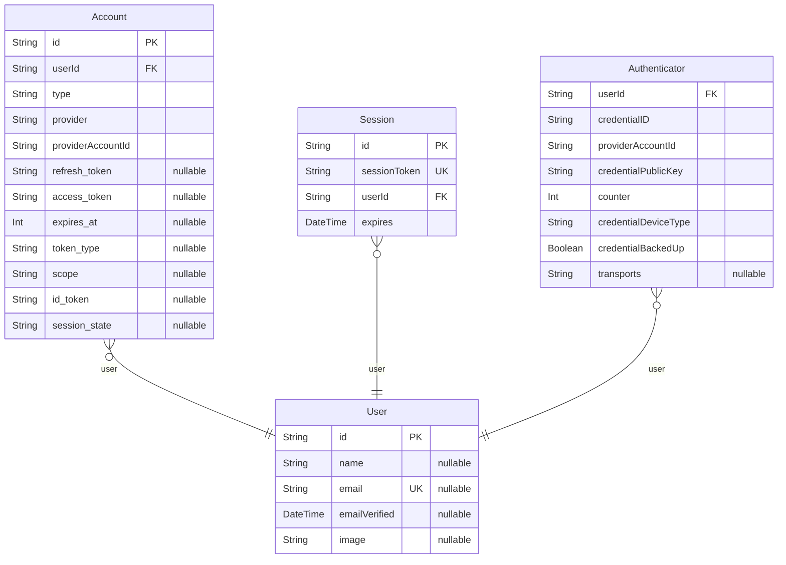

# Prisma Markdown
> Generated by [`prisma-markdown`](https://github.com/samchon/prisma-markdown)

- [Auth](#auth)

## Auth

### `User`
## User

The canonical user record.

**Used by Auth.js for:**
- Linking provider accounts (`Account`)
- Storing database sessions (`Session`)
- Storing passkeys (`Authenticator`, if you enable WebAuthn)

**Properties**
  - `id`
    > Primary key (UUID).
    > Fake data (faker):
    > FAKE:faker.string.uuid()
  - `name`
    > Display name. Optional because some auth flows (e.g., passkey-first) may not collect it.
    > Fake data (faker):
    > FAKE:faker.person.fullName()
  - `email`
    > Email address.
    > 
    > Notes:
    > - Optional to support passkey-only users.
    > - `@unique` still enforces uniqueness **when present**.
    > Fake data (faker):
    > FAKE:faker.internet.email()
  - `emailVerified`
    > When the email was verified (if using an email-based provider / verification flow).
    > Fake data (faker):
    > FAKE:faker.date.past({ years: 2 })
  - `image`
    > Profile image URL.
    > Fake data (faker):
    > FAKE:faker.image.avatar()

### `Account`
## Account

A connection between a `User` and an external identity provider account.

**Examples:** Google OAuth, GitHub OAuth, Microsoft Entra ID (OIDC), etc.

Auth.js identifies an account by the pair:
- `provider` (e.g., `google`)
- `providerAccountId` (the user's ID at that provider)

**Properties**
  - `id`
    > Primary key (UUID).
    > Fake data (faker):
    > FAKE:faker.string.uuid()
  - `userId`
    > Foreign key to `User`.
    > Fake data (faker):
    > FAKE:faker.string.uuid()
  - `type`
    > Provider account type (Auth.js uses values like `oauth`, `oidc`, etc.).
    > Fake data (faker):
    > FAKE:faker.helpers.arrayElement(['oauth','oidc'])
  - `provider`
    > Provider ID (e.g., `google`, `github`, `azure-ad`).
    > Fake data (faker):
    > FAKE:faker.helpers.arrayElement(['google','github','azure-ad'])
  - `providerAccountId`
    > The account ID from the provider.
    > Fake data (faker):
    > FAKE:faker.string.uuid()
  - `refresh_token`
    > OAuth refresh token (if the provider returns one).
    > Fake data (faker):
    > FAKE:faker.string.alphanumeric(64)
  - `access_token`
    > OAuth access token.
    > Fake data (faker):
    > FAKE:faker.string.alphanumeric(64)
  - `expires_at`
    > Access token expiration (epoch seconds), if provided.
    > Fake data (faker):
    > FAKE:Math.floor(Date.now()/1000) + faker.number.int({ min: 3600, max: 86400 * 30 })
  - `token_type`
    > Token type (often `Bearer`).
    > Fake data (faker):
    > FAKE:'Bearer'
  - `scope`
    > OAuth scopes granted.
    > Fake data (faker):
    > FAKE:faker.helpers.arrayElement(['openid email profile','read:user user:email',''])
  - `id_token`
    > ID token for OIDC providers.
    > Fake data (faker):
    > FAKE:faker.string.alphanumeric(256)
  - `session_state`
    > Provider-specific session state (rare, but supported by Auth.js).
    > Fake data (faker):
    > FAKE:faker.string.alphanumeric(16)

### `Session`
## Session

A persisted session record.

Only used when Auth.js is configured for **database sessions**.
The application stores a `sessionToken` in a cookie and looks up the session row.

**Properties**
  - `id`
    > Primary key (UUID).
    > Fake data (faker):
    > FAKE:faker.string.uuid()
  - `sessionToken`
    > Opaque token used to look up this session.
    > 
    > Auth.js will generate this; store it as-is.
    > Fake data (faker):
    > FAKE:faker.string.uuid()
  - `userId`
    > Foreign key to `User`.
    > Fake data (faker):
    > FAKE:faker.string.uuid()
  - `expires`
    > When this session expires.
    > Fake data (faker):
    > FAKE:faker.date.soon({ days: 30 })

### `Authenticator`
## Authenticator

WebAuthn / Passkeys credentials.

This model is required if you enable a Passkey/WebAuthn provider.
It supports:
- Multiple credentials per user
- Device metadata (e.g., backed up, device type)
- Credential counter for replay protection

**Properties**
  - `userId`
    > Foreign key to `User`.
    > Fake data (faker):
    > FAKE:faker.string.uuid()
  - `credentialID`
    > WebAuthn credential ID (base64url-encoded).
    > Fake data (faker):
    > FAKE:faker.string.alphanumeric(48)
  - `providerAccountId`
    > Provider account id (Auth.js uses it to connect the authenticator to an account).
    > Fake data (faker):
    > FAKE:faker.string.uuid()
  - `credentialPublicKey`
    > Public key for the credential.
    > Fake data (faker):
    > FAKE:faker.string.alphanumeric(256)
  - `counter`
    > Signature counter used by WebAuthn for replay protection.
    > Fake data (faker):
    > FAKE:faker.number.int({ min: 0, max: 1000 })
  - `credentialDeviceType`
    > Device type string (platform / cross-platform) depending on the library.
    > Fake data (faker):
    > FAKE:faker.helpers.arrayElement(['platform','cross-platform'])
  - `credentialBackedUp`
    > Whether the credential is backed up / synced.
    > Fake data (faker):
    > FAKE:faker.datatype.boolean()
  - `transports`
    > Optional transports (e.g., `usb`, `nfc`, `ble`, `internal`).
    > Fake data (faker):
    > FAKE:faker.helpers.arrayElements(['usb','nfc','ble','internal']).join(',')